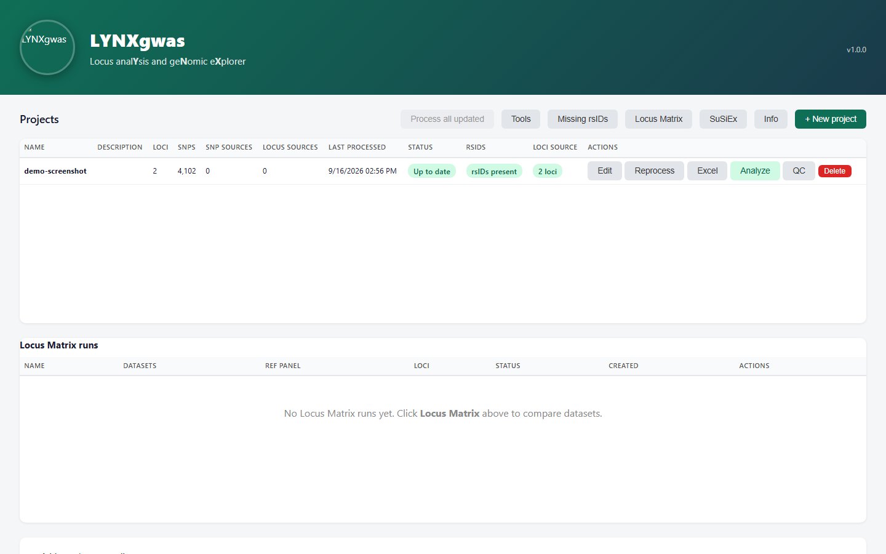
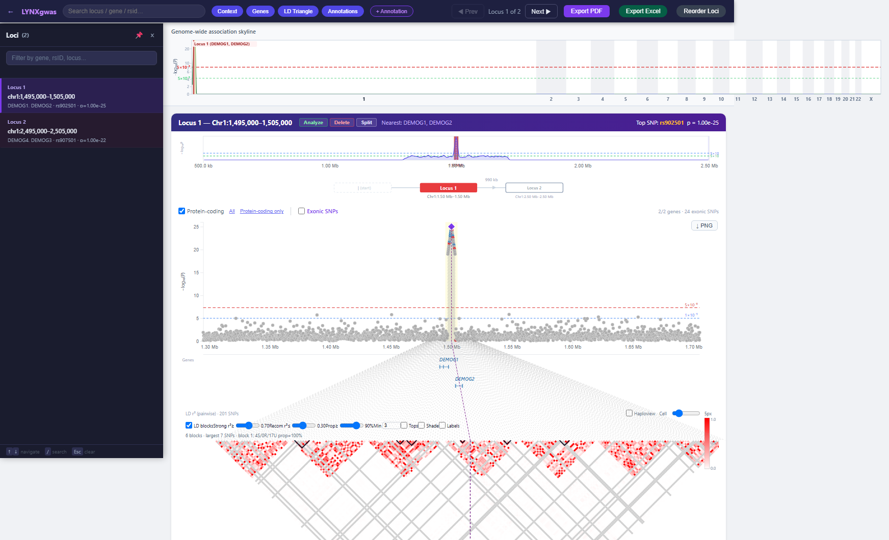

# LYNXgwas

**L**ocus ana**Y**sis and ge**N**omic e**X**plorer — a local GWAS visualization platform.

Point it at your GWAS summary statistics and it identifies loci, recovers rsIDs, computes LD,
runs fine-mapping (SuSiE, FINEMAP, COJO, coloc, GWAMA), and gives you an interactive
Manhattan/LD/gene-track viewer per locus — all in your browser, entirely on your own machine.
No data ever leaves your computer.

[](https://pypi.org/project/lynxgwas/)
[](LICENSE)

## Screenshots

**Home page** — manage multiple GWAS projects, see status and locus/SNP counts at a glance:



**Locus viewer** — Manhattan plot, gene track, and LD triangle for a single locus:



## Install

```bash
pip install lynxgwas
```

Requires a Java 11+ runtime on your machine ([Adoptium](https://adoptium.net/) is a good source
if you don't have one).

## Quick start

```bash
lynxgwas
```

This starts the local server and opens `http://localhost:8765/` in your browser. On first run it
will ask for (or offer to download) two things the pipeline needs:

- **PLINK 1.9** — for LD computation and reference-panel subsetting (`--plink <path>` to skip the prompt)
- **A GENCODE GFF3 annotation** — for the gene track (`--gff3 <path>` to skip the prompt)

Both are remembered afterward. From the home page, use **+ New project** to point LYNXgwas at
your own GWAS summary statistics and walk through the setup wizard.

## Features

- Automatic loci identification from GWAS summary stats (PLINK clumping)
- rsID recovery (local dbSNP + optional NCBI/gnomAD lookups)
- LD computation and pairwise LD triangles per locus
- Fine-mapping: SuSiE, FINEMAP, GCTA-COJO, coloc, GWAMA, and cross-ancestry SuSiEx
- Interactive Manhattan plot, gene track, and locus editing (resize/split/create) in the browser
- Per-locus and whole-genome PDF export; Excel export of all annotated SNPs
- Multi-project management from a single home page

## Requirements

| Requirement | Why | How it's handled |
|---|---|---|
| Java 11+ | Runs the backend | Install separately (bundled Java classes only) |
| PLINK 1.9 | LD, clumping, reference panel subsetting | Prompted for a path, or auto-downloaded |
| GENCODE GFF3 | Gene track annotation | Prompted for a path, or auto-downloaded |
| A PLINK-format reference panel (`.bed`/`.bim`/`.fam`) | LD computation | You supply this in the project wizard |

## Documentation

Full architecture, Java package reference, API endpoints, and configuration keys:
[`docs/ARCHITECTURE.md`](docs/ARCHITECTURE.md)

## License

[MIT](LICENSE)
