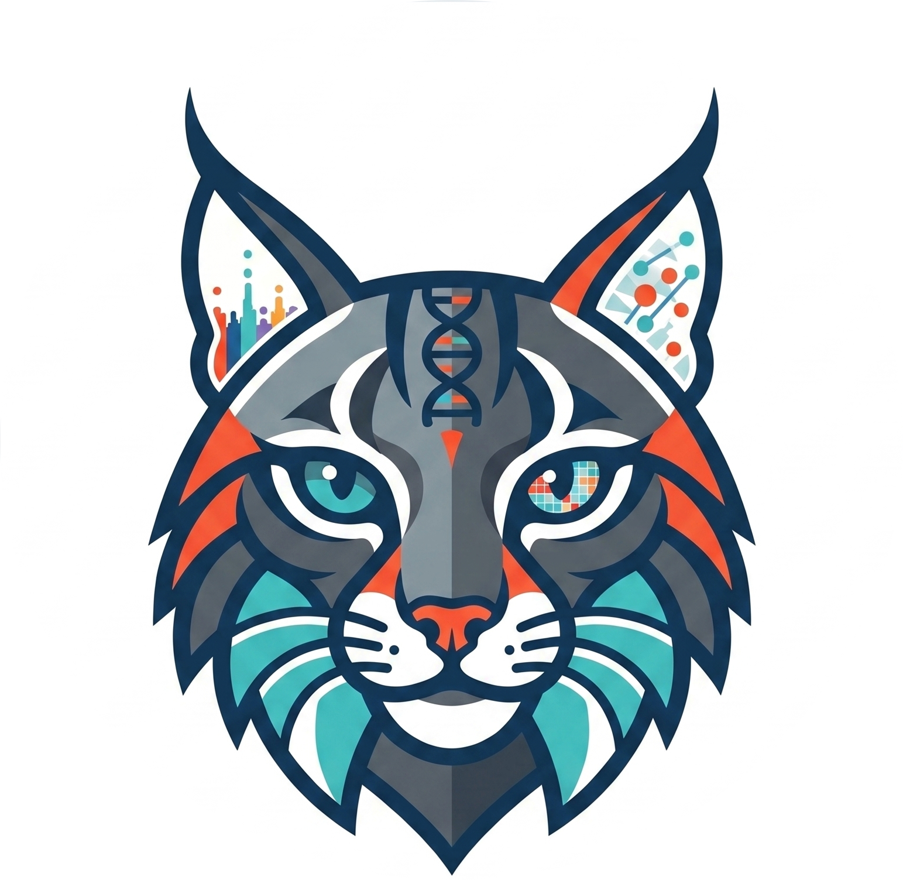

<p align="center">
  
</p>

<h1 align="center">LYNXgwas</h1>

<p align="center">
  <strong>Locus analYsis and geNomic eXplorer</strong><br>
  Multi-project GWAS visualization platform with loci identification, rsID recovery, LD computation, and interactive exploration
</p>

<p align="center">
  
  
  
</p>

---

## Overview

LYNXgwas is a local-first, multi-project GWAS analysis and visualization platform. It takes GWAS summary statistics, identifies loci, recovers rsIDs, computes LD, and produces an interactive browser-based explorer — all from a single Java application with no cloud dependencies.

### What LYNXgwas Can Do

| Capability | Description |
|---|---|
| **Multi-project management** | Create, configure, process, and compare multiple GWAS projects from a single home page. Each project has independent data, configuration, and annotations. |
| **Loci identification** | Identify genomic risk loci from GWAS summary statistics using PLINK LD-based clumping with reference panel matching. Configurable thresholds (p-value, merge distance, clump r²). |
| **rsID recovery** | Recover rsIDs for SNPs lacking them using a local tabix-indexed dbSNP database (HTSJDK, ~99.8% recovery), with optional API completion via NCBI dbSNP and gnomAD (~99.9% combined). |
| **LD computation** | Compute pairwise LD (r²) against a reference panel (e.g. 1000 Genomes) using PLINK, with LD heatmap triangles and Gabriel-style block detection. |
| **Interactive viewer** | Per-locus Manhattan plots, gene tracks (GENCODE GFF3), LD triangles, context sketches, genome-wide skyline overview, and annotation overlays — all in the browser. |
| **Annotation system** | Overlay custom SNP-level and locus-level annotations (fine-mapping PIP, colocalization PP.H4, conditional signals, etc.) with configurable tracks, channels, and visual styles. |
| **PDF export** | Export loci to PDF with configurable resolution (1x–4x), page layout, and track selection. |
| **Project wizard** | Step-by-step guided project creation: file selection, GWAS column mapping with auto-detection, parameter configuration, and processing. |

## Quick Start

### Prerequisites

- **Java 11+** (JDK for building, JRE for running)
- **PLINK 1.9** (for LD computation and loci identification)
- A reference panel in PLINK2 binary format (`.bed/.bim/.fam`)
- Optional: tabix-indexed dbSNP VCF files (for rsID recovery)

### Build & Run

```bash
# Compile
build.bat

# Start the server (opens home page at http://localhost:8765/)
run.bat
```

The home page lists all projects with live status. Use the wizard to create new projects or manage existing ones.

### Command-line Options

```bash
run.bat                      # Start server, show home page (no auto-processing)
run.bat --all                # Process all stale projects, then start server
run.bat --project=myproject  # Process only this project, then start server
```

## Home Page

The home page at `http://localhost:8765/` provides:

- **Project table** with name, loci count, SNP count, annotation sources, status, rsID status, and loci source
- **+ New project** button with step-by-step wizard
- **Reprocess / Edit / Delete** actions per project
- **Get Loci** button for projects without a loci file
- **Add rsIDs** button for projects without rsID annotations
- **Resources & Settings** panel for managing SNP databases and reference panels
- **Process all updated** bulk action

## Workflows

### 1. Create a New Project

**Via wizard (recommended):**
1. Click **+ New project** on the home page
2. Step 1: Enter project name and ID
3. Step 2: Browse for GWAS file, GFF3 annotation, and optionally a loci file and reference panel
4. Step 3: Map GWAS columns (auto-detected from file header)
5. Step 4: Configure locus parameters and LD settings
6. Step 5: Review and process

**Manual:**
1. Copy `projects/config.properties.template` to `projects/{your_id}/config.properties`
2. Edit the config file with your paths and column mappings
3. Run `run.bat --project={your_id}`

### 2. Identify Loci (Get Loci)

For projects without a loci file:
1. Click **Get Loci** on the home page
2. Configure: seed p-value threshold (5e-8 genome-wide or 5e-5 suggestive), merge distance, min SNPs per locus
3. The pipeline streams the GWAS file, matches against the reference panel by chr:pos, runs PLINK clumping (r² 0.6), and merges clump intervals within 250kb
4. Output: `loci.txt` (meta_chr, meta_start, meta_end) + `loci_detail.tsv` with lead SNPs

### 3. Recover rsIDs (Add rsIDs)

For projects where SNPs lack rsID annotations:
1. Click **Add rsIDs** on the home page
2. Select a configured SNP database (dbSNP, tabix-indexed VCF)
3. Optionally enable API completion (NCBI + gnomAD) for remaining unmatched SNPs
4. The pipeline queries dbSNP per-locus via HTSJDK, matches by chr:pos with forward/reverse allele verification, and patches locus JSONs in-place — no full reprocess needed
5. Typical recovery: ~99.8% local, ~99.9% with API completion

### 4. View and Explore

Click any project row to open the interactive viewer:
- Navigate between loci with keyboard arrows or the loci sidebar
- Toggle tracks: context sketch, gene structure, LD triangle, annotations
- Search by locus index, gene name, or rsID
- Resize locus boundaries and recompute on the fly
- Split loci and create new ones from the viewer
- Export to PDF at configurable resolution

## Configuration

### Per-project: `projects/{id}/config.properties`

| Key | Description | Required |
|---|---|---|
| `gwas.file` | GWAS summary statistics (tab-delimited) | Yes |
| `loci.file` | Locus definitions (meta_chr, meta_start, meta_end) | No (use Get Loci) |
| `gff3.file` | GENCODE GFF3 annotation file | Yes |
| `ref.panel.path` | PLINK bfile prefix for LD reference panel | No |
| `ref.panel.population` | Population label (EUR, EAS, AFR, etc.) | No |
| `col.chr` | GWAS column name for chromosome | Yes |
| `col.pos` | GWAS column name for position | Yes |
| `col.pvalue` | GWAS column name for p-value | Yes |
| `col.ea` | GWAS column name for effect allele | Yes |
| `col.nea` | GWAS column name for other allele | Yes |
| `col.rsid` | GWAS column name for rsID (if present) | No |
| `col.beta`, `col.or`, `col.se`, `col.n`, `col.maf`, `col.info` | Optional GWAS columns carried through to viewer | No |
| `locus.padding` | Display padding each side of loci (bp, default 200000) | No |
| `ld.enabled` | Enable LD computation (default false) | No |
| `ld.triangle.boundary` | SNPs each side for LD triangle (default 100) | No |

### Global: `config/global.json`

Manages shared resources across all projects:
- **Reference panels**: PLINK bfile paths with population, build, and validation
- **SNP databases**: tabix-indexed dbSNP VCF folders with per-chromosome file detection
- **API settings**: NCBI and gnomAD configuration for rsID API completion

## Project Structure

```
LYNXgwas/
├── src/                        # Java source files
│   ├── Main.java               #   Pipeline orchestrator + multi-project management
│   ├── Config.java             #   Configuration loading + validation
│   ├── ProjectMetadata.java    #   Fingerprinting, staleness detection, project.json
│   ├── GwasParser.java         #   GWAS summary stats streaming parser
│   ├── LociParser.java         #   Locus definitions parser
│   ├── GffParser.java          #   GFF3 gene annotation parser
│   ├── LdCalculator.java       #   Pairwise LD computation via PLINK
│   ├── PlinkSubsetter.java     #   Reference panel subsetting via PLINK
│   ├── GenomeSkyline.java      #   Genome-wide binned Manhattan skyline
│   ├── SnpAnnotator.java       #   NCBI rsID annotation for lead SNPs
│   ├── JsonExporter.java       #   Per-locus JSON + manifest generation
│   ├── LocusUpdater.java       #   Live locus boundary updates + splitting
│   ├── LocalServer.java        #   HTTP server (API endpoints + static files)
│   ├── ProgressTracker.java    #   Thread-safe phased progress tracking
│   ├── rsid/                   #   rsID recovery module
│   │   ├── RsidRecovery.java   #     HTSJDK-based dbSNP region query
│   │   ├── RsidMatcher.java    #     Forward/reverse allele matching
│   │   ├── RsidPipeline.java   #     Full recovery pipeline + locus JSON patching
│   │   ├── RsidDetector.java   #     Auto-detect rsID column in GWAS file
│   │   ├── GlobalConfig.java   #     Global resources config (ref panels, SNP dbs)
│   │   ├── RsidApiCompleter.java #   API completion orchestrator (NCBI + gnomAD)
│   │   ├── NcbiDbSnpProvider.java #  NCBI Variation Services provider
│   │   ├── GnomadProvider.java #     gnomAD GraphQL provider
│   │   ├── RateLimiter.java    #     Token-bucket rate limiter
│   │   └── RsidApiCache.java   #     Disk-backed API result cache
│   └── loci/                   #   Loci identification module
│       ├── LociIdentifier.java #     GWAS → ref-panel match → PLINK clump → merge
│       └── LociProgress.java   #     Progress tracker for loci identification
│
├── index.html                  # Home page (project table + wizard + rsID/loci modals)
├── viewer.html                 # Interactive locus viewer (project-aware)
├── assets/                     # Static assets (icon)
├── docs/images/                # Project documentation images
│
├── projects/                   # Per-project directories
│   ├── config.properties.template  # Template for manual project creation
│   └── {project_id}/
│       ├── config.properties   #   Project pipeline configuration
│       ├── project.json        #   Metadata, fingerprints, rsID status
│       ├── annotations.yaml    #   Project-specific annotation config
│       └── data/               #   Generated locus JSONs + manifest
│
├── config/
│   └── global.json             # Global resources (ref panels, SNP databases)
│
├── lib/                        # HTSJDK + dependencies (for rsID recovery)
├── input/                      # Shared input files (GWAS, loci)
├── resources/                  # Shared resources (GENCODE GFF3)
├── build.bat                   # Compile script
└── run.bat                     # Run script
```

## API Endpoints

| Endpoint | Method | Description |
|---|---|---|
| `/api/projects` | GET | List all projects with live status |
| `/api/projects/process` | POST | Process stale projects |
| `/api/project/{id}/manifest` | GET | Project manifest |
| `/api/project/{id}/locus/{n}` | GET | Locus data |
| `/api/project/{id}/config` | GET/POST | Read/write project config |
| `/api/project/{id}/progress` | GET | Pipeline progress |
| `/api/delete-project` | POST | Delete a project |
| `/api/peek-file-header` | GET | Read file header columns |
| `/api/global-config` | GET/POST | Global resources config |
| `/api/rsid-recover` | POST | Start rsID recovery |
| `/api/rsid-progress` | GET | rsID recovery progress |
| `/api/rsid-detect` | GET | Auto-detect rsID column |
| `/api/loci-identify` | POST | Start loci identification |
| `/api/loci-progress` | GET | Loci identification progress |
| `/pick-file` | GET | Native file picker dialog |

## Staleness Detection

Projects are automatically detected as stale when:
1. `project.json` doesn't exist (never processed)
2. Pipeline version changed (code update)
3. Input files changed (GWAS, loci, GFF3, config, or reference panel)
4. Annotation config changed (annotations.yaml or referenced files)

Stale projects show "Needs reprocessing" on the home page. Use the **Reprocess** button to update.

## License

MIT
